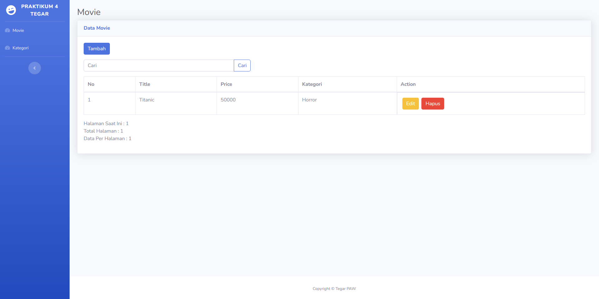

## CRUD Relation (Search + Pagination)
Ya gitu deh, ini buat bantu temen-temen.

## Panduan
- Copy `.env.example` menjadi `.env`
- Ubah pengaturan database
- Jalankan `php artisan key:generate`
- Jalankan `php artisan migrate:fresh`
- Serve seperti biasa dengan `php artisan serve`

## Image
